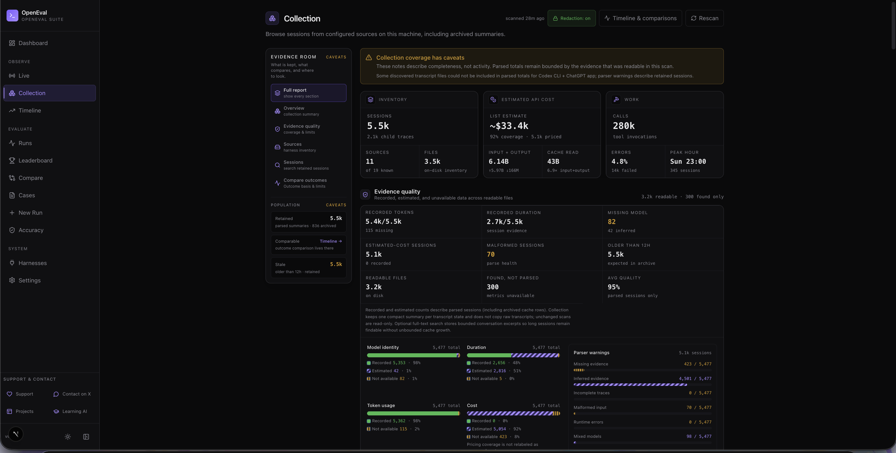
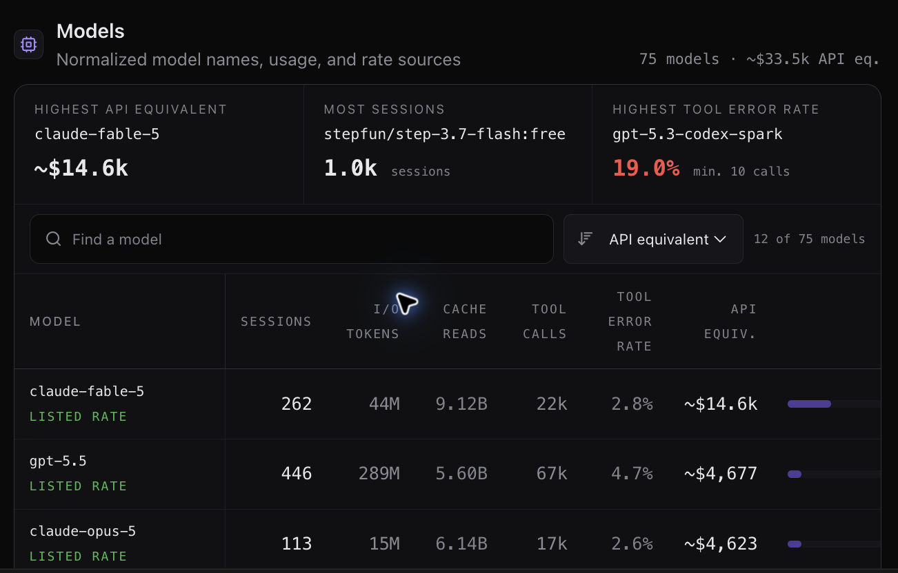
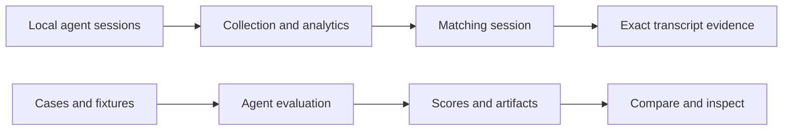

# OpenEval

### See what your agents actually do.

[](https://github.com/RasputinKaiser/OpenEval/actions/workflows/ci.yml)
[](https://github.com/RasputinKaiser/OpenEval/releases)
[](LICENSE)

Inspect local agent conversations, follow analytics into transcript evidence, and run repeatable evaluations—all from one dashboard on your machine.

**[Explore the website](https://rasputinkaiser.github.io/OpenEval/)** · [Try the interactive demos](https://rasputinkaiser.github.io/OpenEval/#playground) · [Install](#install-and-start) · [Documentation](#documentation) · [Latest release](https://github.com/RasputinKaiser/OpenEval/releases/latest)

## Inside OpenEval

Real screenshots from a local installation, reviewed for visible sensitive information. These are capture-time snapshots, not benchmark claims or live totals. **API-equivalent cost is an estimate, not an invoice or subscription usage.**

[](media/screenshots/collection-overview.png)

**Collection:** understand what was collected, how much evidence is available, and where coverage is incomplete.

[](media/screenshots/model-analytics.png)

**Models:** compare usage and tool activity with model identity and pricing coverage visible. [Screenshot provenance](media/screenshots/README.md).

## Choose your starting point

| I want to… | Start here | What happens next |
| --- | --- | --- |
| Understand my existing agent activity | **Collection** | Explore date, source, model, and tool breakdowns; open matching sessions. |
| Find the evidence behind a number | **Session reader** | Search the whole session, jump to a message, and inspect paired tool calls and results. |
| Try a visual evaluation | **Cases → Playground** | Play a reference demo, then select the matching case for an agent run. |
| Compare agents or changes | **New Run → Runs → Compare** | Run a shared case set and inspect scores, artifacts, usage, and grader evidence. |
| Check what a score actually proves | **Accuracy** | Inspect deterministic, trace, visual, judge, and human evidence separately. |



## Install and start

Install **Node 22 with npm 10**, then run:

```bash
git clone --branch v0.2.0 --depth 1 https://github.com/RasputinKaiser/OpenEval.git
cd OpenEval
npm run setup
npm run open
```

Open **http://127.0.0.1:3000**. Setup installs the locked dependencies, checks the
SQLite native binding, and builds the production dashboard. The first build can
take several minutes; later starts reuse it. Stop with **Ctrl+C**.

**No API key, account connection, or paid run is needed to inspect existing local
transcripts.** Open Collection first. Agent authentication is only needed when
you choose to launch an evaluation. No `.env` file is required for the defaults.

[First-run guide, custom ports, updates, and troubleshooting](docs/getting-started.md)

## What you get

- **Connected analytics.** Inspect a chart, pin a selection, and explore the sessions behind it. Keyboard controls, data tables, responsive layouts, and reduced motion support the same workflow.
- **Readable conversation evidence.** Whole-session search, stable message references, expandable tool inputs/results, and separately labelled recorded reasoning keep long sessions navigable.
- **40 repeatable evaluation cases.** Software edits, reasoning, single-tool tasks, and visual artifacts, with five interactive reference demos in the local Playground.
- **Inspectable grading.** Weighted deterministic checks and optional rubric judges retain the outputs and evidence behind each result. A structural check does not become a visual-quality verdict.
- **Local history.** SQLite stores runs and summaries on your machine. The public website is a static tour; it does not connect to your local dashboard or read your transcripts.

## Source support and evaluation runners

Collecting an existing transcript and launching an agent are separate capabilities. Local readers include Claude Code, Codex, Kimi, supported DeepSeek plaintext exports, compatible OpenCode/ZCode stores, and Grok Markdown exports. Support depends on the recorded format and version; a detected source does not imply complete metrics.

**[Source versions and field coverage](docs/interactive-analytics-transcripts.md#source-coverage)** is the detailed compatibility reference. Provider/model identity stays separate from the host tool. Missing usage, tool structure, or attachments remain unavailable.

Bundled evaluation harness descriptors include Claude Code, Codex, and ncode. Other runners can use the same descriptor format: [write a harness](docs/harness-authoring.md).

## Privacy and measurement

- Existing local transcript inspection needs no paid inference. Launching evaluations or optional judge work can invoke your configured agents and incur provider charges.
- Runtime databases, workdirs, and transcripts are excluded from Git by default. Redaction reduces exposure; review exports and screenshots before sharing them.
- Provider-reported cost, estimated API-equivalent cost, and unavailable cost are distinct. Token counts do not establish subscription usage percentages.
- Missing data stays missing. Coverage denominators, parser limitations, and evidence provenance remain part of the result.

[Redaction](docs/redaction.md) · [Data and operating details](docs/project-reference.md#local-data-and-privacy) · [Report a security issue](SECURITY.md)

## What’s new in v0.2.0

- **Follow a chart into its evidence.** Shared date controls, pinned inspections, model/source breakdowns, and matching-session links connect analytics to source-qualified conversations. Missing measurements remain distinct from zero; estimated API-equivalent cost remains distinct from recorded cost.
- **Read and search whole sessions.** Bounded search reaches beyond the loaded page, opens the matching message window, and keeps tool calls, results, recorded reasoning, and source revisions explicit.
- **Watch evaluations.** Five interactive reference demos join a 40-case library: route planning, a data story, marble physics, a firefly garden, and a rhythm game. Play, stop, and replay artifact previews; reference demos are labelled separately from agent output.
- **Compare evidence carefully.** Saved experiment snapshots and calibration tools distinguish human attestations, synthetic observations, missing evidence, and cohort differences.
- **More local source formats.** Fixture-backed readers cover Kimi wire streams, DeepSeek plaintext session v3, compatible OpenCode/ZCode databases, and Grok Markdown exports. See the [version and field coverage table](docs/interactive-analytics-transcripts.md#source-coverage) for unsupported formats and limits.
- **Easier installation and updates.** `npm run setup` installs, verifies SQLite, and builds; `npm run open` starts the dashboard on loopback. **Settings → OpenEval updates** checks GitHub on demand and shows release links and installation instructions. Updating is a terminal operation, not an automatic server replacement.
- **A calmer, more usable interface.** Responsive chart controls, keyboard inspection, reduced-motion behavior, clearer evaluation setup, readable transcripts, and refined typography preserve OpenEval’s charcoal/violet design.

[Release notes and validation limits](docs/releases/v0.2.0.md) · [Installation guide](docs/getting-started.md) · [Watchable evaluations](docs/watchable-evaluations.md)

## Documentation

| Guide | Use it for |
| --- | --- |
| [Getting started](docs/getting-started.md) | Installation, custom ports, updates, and troubleshooting. |
| [Analytics and transcripts](docs/interactive-analytics-transcripts.md) | Chart interactions, transcript search, source coverage, and limitations. |
| [Watchable evaluations](docs/watchable-evaluations.md) | Reference demos, artifact previews, and what their checks prove. |
| [Case authoring](docs/case-authoring.md) | Prompts, fixtures, budgets, graders, and visual contracts. |
| [Grader reference](docs/graders.md) | Evidence tiers, weights, and pass-threshold math. |
| [Harness authoring](docs/harness-authoring.md) | Descriptor-based agent integrations. |
| [Architecture](docs/architecture.md) | The execution, parsing, persistence, and dashboard dataflow. |
| [Operating reference](docs/project-reference.md) | Routes, CLI commands, project layout, and advanced workflows. |
| [GitHub Pages](docs/github-pages.md) | Building and publishing the static project website. |
| [Release history](docs/release-history.md) | Earlier release highlights, preserved as historical context. |

## Contributing

Use Node 22 and npm 10. Install locked dependencies with `npm ci`, then start development with `npm run dev`.

```bash
npm run typecheck
npm run lint
npm test
```

For the release gate, stop the development server first and run `npm run verify:release`. Development and production builds share `.next` by default. See [CONTRIBUTING.md](CONTRIBUTING.md) for the contribution workflow.

[Report a bug](https://github.com/RasputinKaiser/OpenEval/issues/new/choose) · [Discuss an idea](https://github.com/RasputinKaiser/OpenEval/discussions) · [Support the project](https://ko-fi.com/rasputinkaiser)

<details>
<summary>Earlier launch film and build credits</summary>

The [v0.1.1 launch film](https://github.com/RasputinKaiser/OpenEval/releases/download/v0.1.1/openeval-launch-v0.1.1.mp4) is a historical walkthrough. The current application release is v0.2.0.

### Build Credits

- **OpenEval:** developed with Noumena Code, Claude Code (including Fable 5 and Sonnet 5), and OpenAI Codex. Fable 5 contributed substantially to the application itself.
- **v0.1.6:** dashboard visualizations, outcome-evidence hardening, judge v3, and model taxonomy authored with GLM 5.3 Flash and Qwen 3.8 Flash (Hermes Desktop).
- **Launch film:** GPT-5.6 Sol (High) led the edit, composition, visual QA, and final release pass; GPT-5.6 Luna (xhigh) contributed additional iteration passes.
- **Production stack:** Codex, ImageGen, TouchDesigner, HyperFrames, GSAP, CDP Recorder, and FFmpeg.
- **Acknowledgment:** huge thanks to [@KingBootoshi](https://x.com/KingBootoshi) from [righttointelligence.org](https://righttointelligence.org).

</details>

## License

[MIT](LICENSE).
